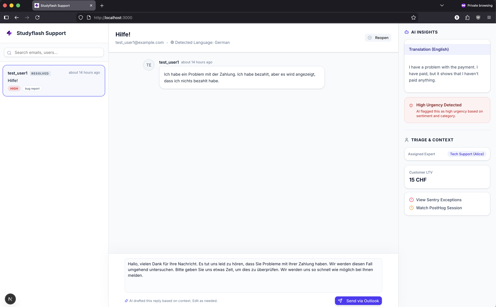
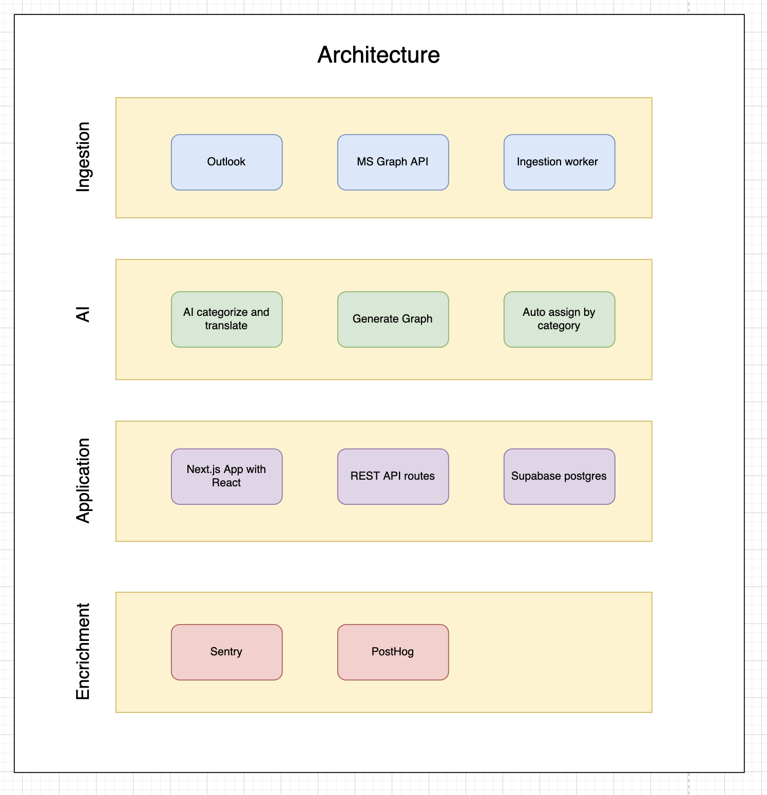
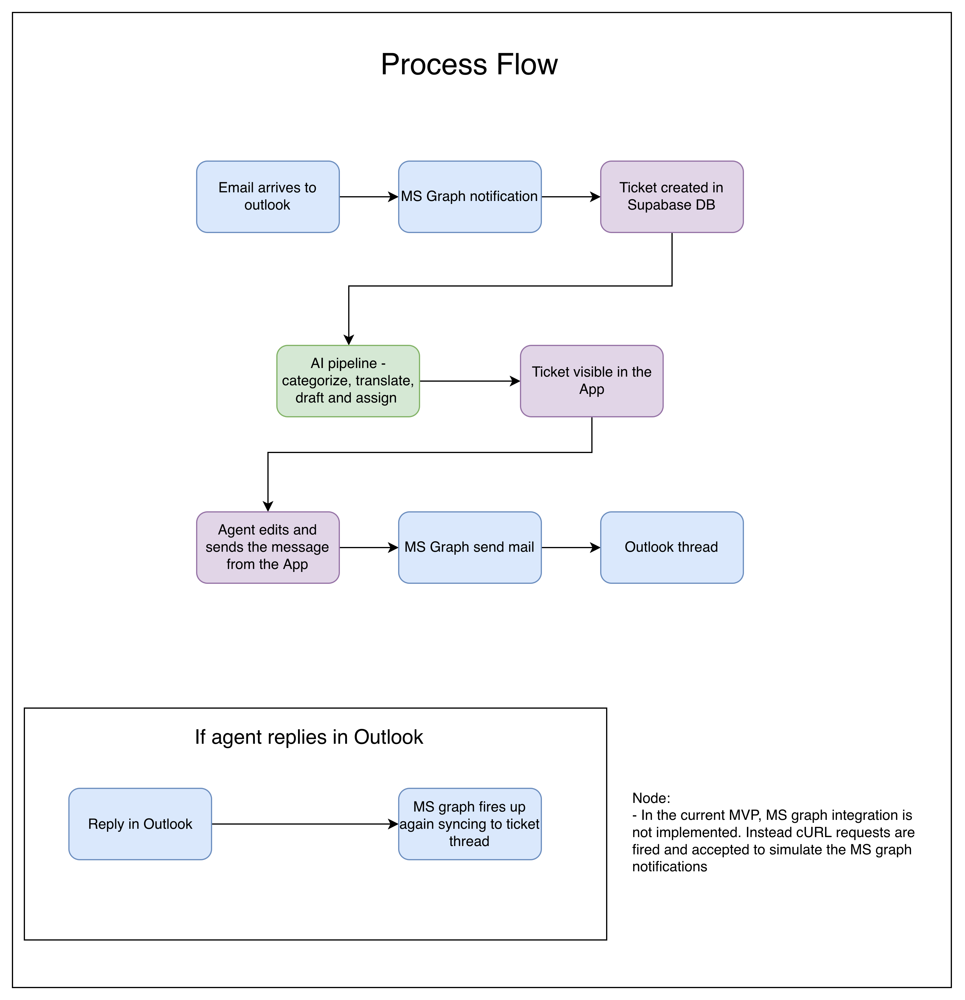

# Studyflash Support MVP

An intelligent, AI-powered internal support platform built as a layer on top of email services. It automatically categorizes incoming support emails, assesses urgency, drafts multilingual replies, and synchronizes seamlessly with the database.

This system is meant to be as simple as possible but still fulfill the requirements of the assignment. Things like MS Graph API integration, user authentication and enrichment with Sentry and PostHog are left out because they are not necessary for a MVP. But these things can be added later on.

**_Note:_** The customer LTV is not real. It is just a mock value. In a real scenario this would be fetched from the database or a billing provider like Stripe to get better information about the customer.



## Core Features
1. **AI Triage Pipeline**: Evaluates incoming support emails for language, category, and urgency using Google Gemini.
2. **Auto-Assignment**: Automatically routes high-severity bugs to Engineers, refund tasks to Billing, and generic issues to Support based on their semantic category.
3. **Multilingual Support**: If a user emails in German (or any other language), the AI automatically translates the body to English for the dashboard, but drafts a highly professional reply *in the user's native language*.
4. **WebSockets Sync**: The platform relies entirely on real-time data streaming via Supabase Realtime instead of inefficient polling.
5. **Thread Syncing**: If a user replies to an ongoing email chain, the webhook smartly appends their reply natively into the existing ticket thread instead of opening a duplicate issue, and reopens it if it was marked as closed.

## Tech Stack
- **Framework**: Next.js 15 (App Router), React, TypeScript
- **Styling**: Tailwind CSS, Shadcn UI
- **Database / Realtime**: Supabase (PostgreSQL)
- **AI Engine**: Google Gemini (via Vercel AI SDK)

---

## Setup Instructions

### 1. Environment Variables
Create a `.env` file in the root directory and add the following keys.

```env
NEXT_PUBLIC_SUPABASE_URL="https://your-project.supabase.co"
NEXT_PUBLIC_SUPABASE_ANON_KEY="your-anon-key"
GOOGLE_GENERATIVE_AI_API_KEY="your-gemini-key"
```

### 2. Database Initialization
This application requires three configured tables: `tickets`, `messages`, and `user_data_mocks`. It also strictly requires Postgres Replication to be enabled for WebSockets to work.

Run the provided SQL migration in your Supabase SQL Editor:
```bash
cat supabase/migrations/20260321142849_initial_schema.sql
```

### 3. Installation
Install the project dependencies and boot the development server:
```bash
npm install
npm run dev
```

### 4. Testing
To test the webhook, you can use the `curl` command to send a POST request to the webhook endpoint.
```bash
curl -X POST http://localhost:3000/api/webhooks/incoming \
  -H "Content-Type: application/json" \
  -d '{ "subject": "<subject>", "text": "<text>", "from_email": "<from_email>", "from_name": "<from_name>" }'
```

---

## Technical Architecture Guide

#### 1. General Architecture

- The MS Graph API integration is left out because for a MVP it is not necessary. We can just use the webhook to receive emails to test the MVP.
- The AI is used to categorize the emails and to draft responses. 
- The dashboard is built using Next.js 15 (App Router), React, TypeScript, Tailwind CSS, Shadcn UI.
- The database is built using Supabase (PostgreSQL).
- The AI is built using Google Gemini (via Vercel AI SDK).
- The enrichment part is Sentry and PostHog because it was mentioned in the assignment. But it has not been implemented yet because just like the MS Graph API integration it is not necessary for a MVP. But these things can be added later on.

#### 2. Process Flow


#### 2. Incoming Webhook (`/api/webhooks/incoming`)
- Acts as the POST receiver for Outlook/mail integrations.
- Extracts sender info and email body, and passes it to `gemini-2.5-flash`.
- Uses Strict Structured Outputs (Zod Object definitions) to force Gemini to provide deterministic category labels, urgency statuses, translations, and assignees.
- Applies regex to map incoming email names and subjects to active threads, appending messages seamlessly.

#### 3. Dashboard UI (`/components/dashboard.tsx`)
- Contains a complex Tri-Pane interactive layout.
- Completely avoids manual data reloading by subscribing to `tickets` and `messages` changes via `supabase.channel()`.
- Supports Optimistic UI updates when an Agent directly hits "Resolve" or Sends a draft.


